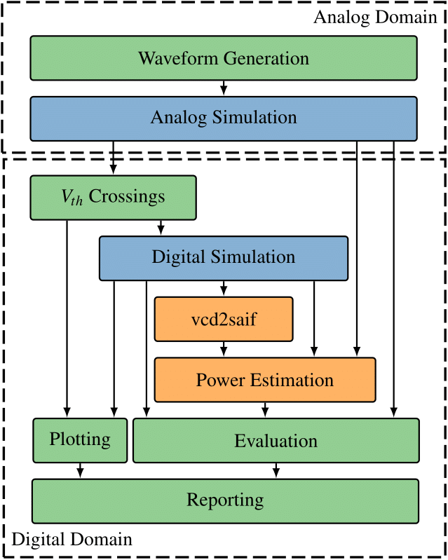

# Involution Tool

The Involution Tool is a tool for accurate digital timing and power analysis. 
It is based on the theoretical foundations of the [Involution Delay Model](https://ieeexplore.ieee.org/document/7092619).

The tool compares the Involution Delay Model with well-established standard delay models, for example the one incorporated in *ModelSim*. Moreover, the results obtained by the digital delay models are compared against a reference *Spice* simulation.

The Involution Tool is a framework which automates the simulation process and supports the user in evaluating the results. 
The ultimate goal is to support and improve the theoretical model.

## Getting Started

Clone the repository to your local machine.

### Prerequisites
* *python2.6* and *python3.6* (we are working on a version which only uses Python >= 3)
* *HSPICE* or *Spectre* (or any other SPICE software like Ngspice, LTspice)
* *ModelSim* (or any other HDL simulator like Vivado)
* *DesignCompiler* and *PrimeTime* for power estimation (one tool is already sufficient, multiple tools increase the meaningfulness of the results)

### Running the Involution Tool

After cloning the repository and installing all the prerequisites, the first sample circuit can be run.

__Note that due to license issues, the **.sp*, **.spf*, **.sdf* and **.spef* files cannot be included in this repository at the moment.__

A description on how the physical synthesis with Encounter, for example for the *mips_clock_15nm*, works can be found [here](https://paginas.fe.up.pt/~jcf/ensino/disciplinas/mieec/pcvlsi/2015-16/tut_encounter/tut_encounter.html).

The repository includes several sample circuits, in this tutorial the *mips_clock_15nm* circuit is used.

For simplicity it is assumed that all the default tools (*Spectre*, *ModelSim*, *DesignCompiler* and *PrimeTime*) specified as prerequisites are installed and that the [15nm Nangate Open Cell Library](https://www.researchgate.net/publication/274254091_Open_Cell_Library_in_15nm_FreePDK_Technology) is available. 
Otherwise the workflow has to be adapted to the used tools and the libraries. See the [manual](manual/manual.pdf) for a detailed description how to use different simulation tools and how to change the libraries.

In this tutorial, the toolchain is executed step by step, so that the user gains insights into the workflow. An overview can also be seen in the figure below. 

1. Adapt the path to the libraries in [config_15nm.cfg](circuits/config_15nm.cfg).
2. cd into the folder for the [inv_tree_15nm](circuits/inv_tree_15nm/) circuit.
3. `make generate` / Waveform Generation: The main\_new.sp file is the main spice file, which contains placeholders for VDD, temperature and the input waveform. In this step, the placeholders are filled with the specified values and the randomly generated input waveform. The resulting file is saved in the input folder.
4. `make spice` / Analog Simulation: Spectre executes the simulation and stores the results in the spice folder. Besides the resulting traces, this folder also contains a file with the power meassurement results.
5. `make crossings` / Vth Crossings: The traces are digitized and copied into the crossings folder. These traces are the foundation of the digital simulation.
6. `make read` / Digitial Simulation: The digitized traces are read and prepared to be read by the *ModelSim* testbench. For each input of the circuit, a separate file is generated containing the time of the transition and the value. These files are stored in the vectors folder.
7. `make sim` / Digitial Simulation: *ModelSim* is used to run a digital simulations. One simulation uses the standard delay model of *ModelSim*, and the second one uses the involution delay model. The latter one uses gates which are incorporating the involution delay model. These gates can be generated with `make gates`, and can be found in the gates folder. The results of the *ModelSim* simulation are two value change dump (vcd) files, which are later used for power estimation
8. `make power` / vcd2saif, Power Estimation: In total, 9 power estimations are performed in this step. The spice trace is used as reference, and compared to the results of the *ModelSim* simulation for the standard delay model and the involution delay model. For each of the three traces, three different tools / settings are used. *DesignCompiler* and *PrimeTime* average-based rely on a switching activity interchange format (saif) file, which is a generated out of the vcd file and is a condensed version of the later. *PrimeTime* time-based directly uses the vcd files, which still contains information about the transition times. This enables the tool to also estimate the maximum power consumption.  The resulting files (.power) can be found in the power folder.
9. `make report` / Plotting, Evaluation, Reporting: In the final step, all results are extracted and brought into one unified format (results.json). Each execution of this step generates a subfolder in the results directory with the current timestamp. The reporting step is highly customizeable, in the standard version a Latex report is generated, containing information about the power consumption and the waveform accuracy. The displayed information is just a small fraction of the extracted results - more information on the extracted results and how to process them further can be found in the [manual](manual/manual.pdf).

## Manual
A detailed manual for the Involution Tool can be found [here](manual/manual.pdf). 

## License

The Involution Tool is made available under the [GNU GPL v3.0 license](https://www.gnu.org/licenses/gpl-3.0.en.html)

## Acknowledgements

Initial version of the channel implementation and the tool by [jmaier0](https://github.com/jmaier0)

[rawread.py](./experiment_setup/python/rawread.py) from [snmishra](https://github.com/snmishra) ([rawread.py](https://gist.github.com/snmishra/27dcc624b639c2626137#file-rawread-py))
